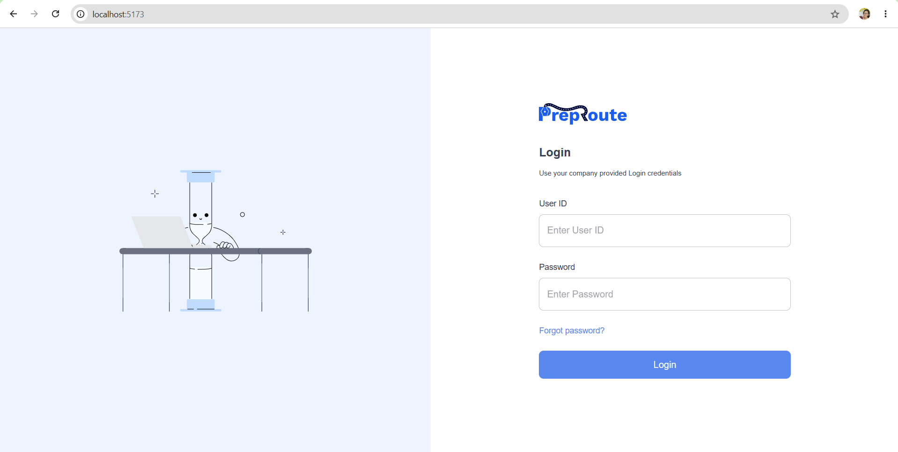
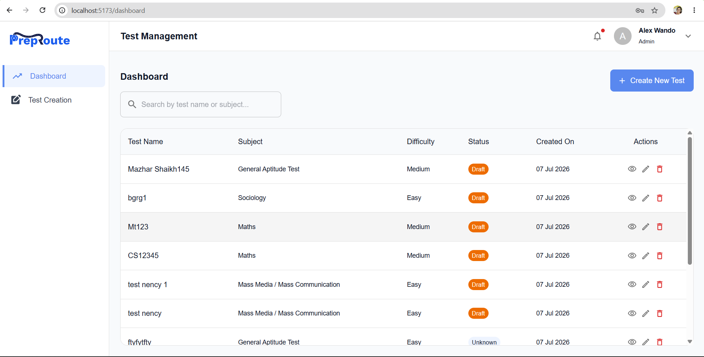
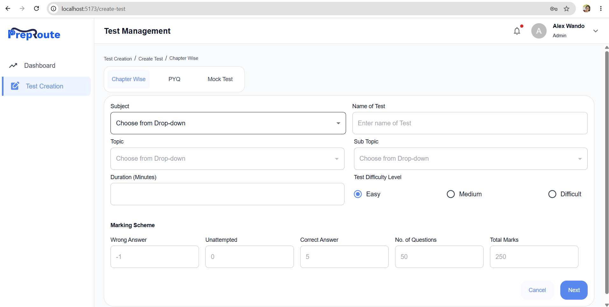

# Test Management System

A modern React + TypeScript application for creating, managing, previewing, and publishing tests. The application provides an intuitive workflow for test creation, question management, and publishing while following modern frontend development practices.

---

# Features

## Test Management

- Create new tests
- Edit existing tests
- Chapter-wise test support
- Subject, Topic and Sub Topic selection
- Dynamic Topic/Sub Topic loading based on selected Subject
- Configurable marking scheme
- Configurable test duration
- Difficulty level selection
- Form validation using React Hook Form

---

## Question Management

- Add Multiple Choice Questions (MCQs)
- Edit existing questions
- Delete questions
- Rich text editor support
- Explanation support
- Difficulty selection
- Bulk question creation
- Question sidebar with quick navigation
- Save & Continue workflow

---

## Preview & Publish

- Complete test overview
- Question preview
- Question navigation sidebar
- Publish settings
- Publish immediately
- Schedule publish UI (ready for backend integration)
- Publish test
- Success and error notifications

---

## User Experience

- Responsive layout
- Reusable components
- Loading indicators
- Snackbar notifications
- Empty state handling
- Form validation
- Error handling
- Breadcrumb navigation

---

# Tech Stack

## Frontend

- React 19
- TypeScript
- Vite

## UI

- Material UI (MUI)
- MUI Icons

## Routing

- React Router DOM

## Forms

- React Hook Form

## API

- Axios

## State Management

- React Hooks
- Component state

---

# Project Structure

```
src
│
├── api
│
├── components
│   ├── AppBreadcrumbs
│   ├── AppSnackbar
│   ├── FormField
│   ├── Header
│   ├── Sidebar
│   ├── TestOverviewCard
│   └── ...
│
├── constants
│
├── layouts
│
├── mappers
│
├── pages
│   ├── Dashboard
│   ├── CreateTest
│   ├── AddQuestions
│   ├── PreviewAndPublish
│   └── Login
│
├── routes
│
├── types
│
└── utils
```

---

# Screenshots

## Login



## Dasboard



## Create Test



# Application Workflow

```
Dashboard
      │
      ▼
Create Test
      │
      ▼
Add Questions
      │
      ▼
Preview Test
      │
      ▼
Publish Test
```

The application also supports editing previously created tests before publishing.

---

# API Integration

The application integrates with REST APIs for:

- Login
- Fetch Subjects
- Fetch Topics
- Fetch Sub Topics
- Create Test
- Update Test
- Fetch Test Details
- Bulk Create Questions
- Bulk Fetch Questions
- Publish Test

---

# Validation

The application performs client-side validation using React Hook Form.

Validation includes:

- Required fields
- Numeric validation
- Maximum character limits
- Dependent dropdown validation
- Question validation
- Marking scheme validation

---

# Reusable Components

The application has been designed using reusable components to improve maintainability.

Examples include:

- AppBreadcrumbs
- AppSnackbar
- FormField
- TestOverviewCard
- QuestionSidebar
- QuestionPreview
- PublishSettings
- Header
- Sidebar

---

# Error Handling

The application includes:

- API error handling
- Snackbar notifications
- Loading states
- Empty states
- Graceful handling of missing backend data

---

# Running the Project

## Clone the repository

```bash
git clone <repository-url>
```

---

## Install dependencies

```bash
npm install
```

---

## Configure environment

Create a `.env` file in the project root.

Example:

```env
VITE_API_BASE_URL=http://localhost:3000
```

Replace the URL with the appropriate backend endpoint.

---

## Start development server

```bash
npm run dev
```

The application will be available at

```
http://localhost:5173
```

---

## Build for production

```bash
npm run build
```

---

## Preview production build

```bash
npm run preview
```

---

# Assumptions

- Authentication is handled by the backend.
- Schedule Publish UI has been implemented and is ready for backend integration.
- Backend APIs provide Subjects, Topics, and Sub Topics dynamically.
- Question preview depends on the backend returning question details.

---

# Future Improvements

- Search and filter questions
- Rich text/image support in questions
- Drag-and-drop question ordering
- Question import via CSV/Excel
- Pagination for large question banks
- Unit testing
- End-to-end testing
- Role-based access control
- Dark mode support

---

# Author

**Tripat Kaur**

Senior Frontend Engineer

Built as part of the Frontend Technical Assessment.
